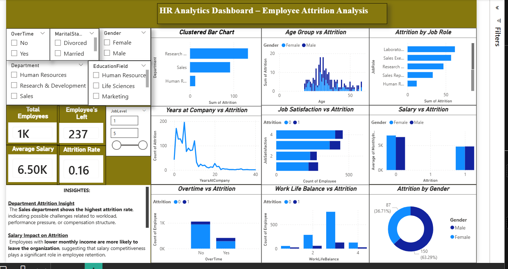

###### **HR Analytics: Employee Attrition Analysis**

###### 

###### **Problem Statement**


Employee attrition is a major challenge for organizations, leading to increased hiring costs and loss of productivity.

This project analyzes employee data to identify key factors driving attrition and help organizations improve retention strategies.


###### **Dataset**


The dataset contains employee information such as:


\* Department (Sales, HR, R\&D)

\* Job Role \& Job Level

\* Salary \& Compensation

\* Job Satisfaction

\* Work-Life Balance

\* Overtime Status

\* Years at Company

\* Target Variable: Attrition (Yes/No)

###### 

###### **Tools \& Technologies**


\* Python (Pandas, NumPy)

\* Data Visualization (Matplotlib, Seaborn)

\* Dashboarding (Power BI)

\* Data Analysis \& KPI Tracking


###### **Project Workflow**


**1. Data Cleaning**


&#x20;  \* Handled missing values

&#x20;  \* Standardized employee attributes


**2. Data Analysis**


&#x20;  \* Attrition distribution across departments

&#x20;  \* Salary vs attrition analysis

&#x20;  \* Job satisfaction \& work-life balance impact


**3. KPI Tracking**


&#x20;  \* Total Employees

&#x20;  \* Employees Left

&#x20;  \* Attrition Rate

&#x20;  \* Average Salary


**4. Dashboard Development**


&#x20;  \* Built interactive HR dashboard

&#x20;  \* Added filters (department, gender, job level, etc.)

&#x20;  \* Visualized employee trends and patterns


###### **Key Insights (From Dashboard)**


**1.Overall Attrition**


\* Total employees: \*\*\~1000\*\*

\* Employees left: \*\*237\*\*

\* Attrition rate: \*\*\~16%\*\*, indicating moderate employee turnover


**2.Department Analysis**


\* Sales department shows the highest attrition rate

\* Suggests workload pressure or compensation challenges


**3.Salary Impact**


\* Employees with lower salaries are more likely to leave

\* Compensation plays a critical role in retention


**4.Experience \& Tenure**


\* Employees with low years at company show higher attrition

\* Early-stage employees are more likely to leave


**5.Work-Life Balance**


\* Poor work-life balance increases attrition probability

\* Balanced employees show better retention


**6.Overtime Impact**


\* Employees working overtime are more likely to leave

\* Workload management is crucial


**7.Job Satisfaction**


\* Lower job satisfaction strongly correlates with higher attrition

\* Employee engagement is key


**8.Gender Insights**


\* Attrition distribution varies slightly by gender

\* No extreme imbalance observed

###### 

###### **Dashboard Preview**


(Add your screenshot here)

###### 

###### **Business Impact**


\* Helps HR teams identify high-risk employee segments

\* Improves retention strategies using data insights

\* Reduces hiring and training costs

\* Enhances employee satisfaction and productivity

## 📊 HR Analytics Dashboard

### 📸 Dashboard Preview


---

## 🎥 Demo Video
👉 [Click to Watch Demo](hr_analysis.mp4)


###### **How to Run**


```bash id="run111"

pip install -r requirements.txt

python main.py

```

###### **Future Improvements**


\* Build predictive attrition model (ML)

\* Add employee sentiment analysis

\* Integrate HR systems for real-time insights

\* Develop retention recommendation system


###### **Author**


Thiviyesh K
Aspiring Data Analyst
